# Quantive

Quantive is a full-stack sales management platform designed to streamline customer interactions, track sales performance, and provide insightful analytics for business growth.

---

## 🚀 Tech Stack

**Frontend:** React.js  
**Backend:** Java Spring Boot (Core Business Logic), Node.js
**Database:** MySQL  
**Build Tool:** Maven  
**Version Control:** Git & GitHub

---

## 📌 Features

### **Admin**
- Manage users (create, edit, assign roles)
- Configure system settings
- View organization-wide analytics
- Manage product catalog and pricing

### **Sales Executive**
- Manage leads and customer records
- Create and update sales opportunities
- Track sales pipeline
- Generate sales reports

### **Customer**
- View products/services
- Place orders
- Track order status
- Access invoices and payment history

---
MindMap

```mermaid 
mindmap
  root((Quantive))
    🌐 Admin
      🧑‍💼 User Management
        Create/Edit/Deactivate Users
        Assign Roles & Permissions
      📦 Product Management
        Add/Update/Remove Products
        Set Pricing, Stock, Categories
      📊 Sales Oversight
        View & Filter Sales Records
        Export Reports (CSV/PDF)
      📈 Analytics Dashboard
        Company-wide KPIs
        Product Performance Charts
        Top Customers & Executives Leaderboard
      ⚙️ System Settings
        Tax Rates
        Currency
        Notifications
    💼 Sales Executive
      👥 Customer Management
        Add/Update Customers
        View Assigned Customers
      📝 Sales Entry
        Record New Transactions
        Apply Discounts & Offers
      🎯 Performance Tracking
        Personal Dashboard
        Targets Progress
      📑 Reporting
        Export Personal Data
        View Commissions
    🛒 Customer
      🧾 Profile Management
      📜 Purchase History
        View Past Orders
        Download Receipts
      🎁 Offers & Notifications
        Promotions
        New Product Alerts
    🔗 Common
      🔐 Authentication & Authorization (JWT, Role-based)
      📱 Responsive Design
      🔍 Search & Filters
      ⚠️ Error Handling & Feedback

``` 



## 🔐 Role–Permission Matrix

| Feature / Action                | Admin | Sales Executive | Customer |
|---------------------------------|:-----:|:---------------:|:--------:|
| User Management                 | ✅    | ❌              | ❌       |
| Product Management              | ✅    | ❌              | ❌       |
| View Sales Analytics            | ✅    | ✅              | ❌       |
| Manage Leads                    | ❌    | ✅              | ❌       |
| Place Orders                    | ❌    | ✅              | ✅       |
| View Order Status               | ❌    | ✅              | ✅       |
| Access Invoices                 | ❌    | ✅              | ✅       |

---

## 🗄 Database Schema (Draft)

**Entities:**
- Users
- Roles
- Products
- Orders
- Leads
- Sales Analytics

**Relationships:**
- One-to-many: Role → Users
- One-to-many: User → Orders
- Many-to-many: User ↔ Leads
- One-to-many: Product → Orders

---
## 📌 Installation & Setup

```bash
# Clone the repository
https://github.com/Khyaded-Ambika/Quantive

# Navigate to backend directory
cd backend
mvn clean install
mvn spring-boot:run

# Navigate to frontend directory
cd frontend
npm install
npm start

